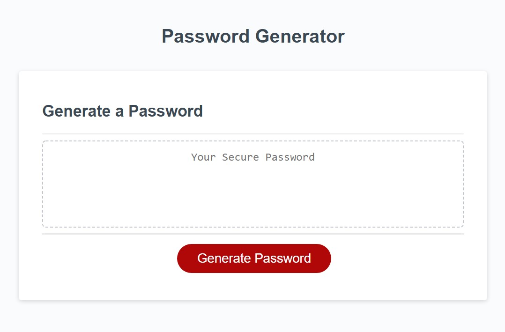

# Random Password Generator

## Description

This random password generator will create a unique password for the user based on their length and character preferences. The user can choose the password length and whether or not they would like to include lowercase letters, uppercase letters, numbers, and/or special characters in the final password. This generator can be used as many times as needed and makes it easier to come up with strong, more secure passwords to protect the user's information. This web application was built using HTML, CSS, and Javascript. HTML and CSS were used for layout and aesthetic purposes only. All functionality was written using Javascript.

## Link to Password Generator
[Password Generator](https://autumnlegere.github.io/topsecretpasswords/)

## Screenshot

This is a screenshot of the web page.

## Credits

I used snipets of code from the following places:

- Code for making an enitre array uppercase  

    - [bobbyhadz.com](https://bobbyhadz.com/blog/javascript-convert-all-elements-of-array-to-uppercase#:~:text=To%20convert%20all%20array%20elements,all%20strings%20converted%20to%20uppercase.)

- List of Special Characters  

    - [owasp.org](https://owasp.org/www-community/password-special-characters)

- Code for different types of pop up boxes  

    - [sebhastian.com](https://sebhastian.com/javascript-confirmation-yes-no/)

- Code for linking variables into the pop up boxes, linking user pop up selections to the password character options array, and generating a random loop from this array to create a random password. This youtube video offers a beginning to end solution to this challenge, but I only used the code base for the items listed above.  

    - [Daniel Vega - Random Password Generator in Javascript](https://youtu.be/v2jfGo7ztm8)

The rest of the code you see is either original or taken from the University of Arizona's Coding Bootcamp activities.

Enjoy!